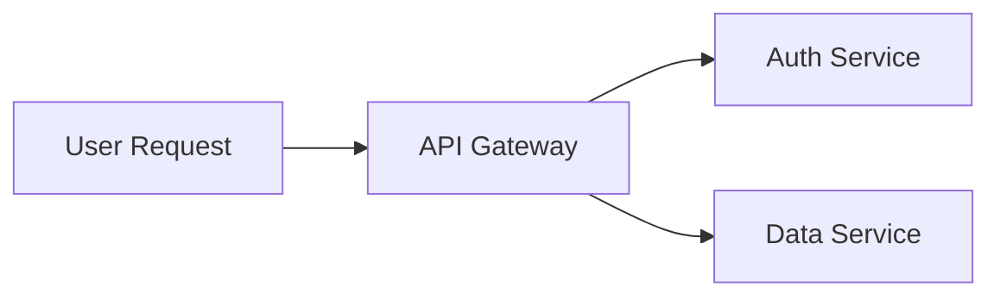

# Document-Focused Ingestion Implementation Plan

> **For agentic workers:** REQUIRED SUB-SKILL: Use superpowers:subagent-driven-development (recommended) or superpowers:executing-plans to implement this plan task-by-task. Steps use checkbox (`- [ ]`) syntax for tracking.

**Goal:** Narrow file ingestion to document types (md, txt, pdf, docx, xlsx, xls, archimate) with mermaid semantic enrichment, dropping all code/config files.

**Architecture:** Shrink the suffix sets in `FileExtractor`, add three new extraction methods (xlsx, xls, archimate), add mermaid parsing to the markdown section parser. All new extractors produce heading-structured text that feeds into existing chunking.

**Tech Stack:** openpyxl (xlsx), xlrd (xls), xml.etree.ElementTree (archimate), regex (mermaid)

**Spec:** `docs/superpowers/specs/2026-04-06-document-focused-ingestion-design.md`

---

## File Structure

| File | Role |
|------|------|
| `pyproject.toml` | Add openpyxl, xlrd dependencies |
| `libs/file-ingest/src/second_brain_file_ingest/extractors.py` | Shrink suffix sets, add xlsx/xls/archimate extraction |
| `libs/file-ingest/src/second_brain_file_ingest/mermaid.py` | Mermaid code block parser (new) |
| `libs/file-ingest/src/second_brain_file_ingest/local.py` | Integrate mermaid enrichment into markdown parsing |
| `tests/test_file_ingest.py` | Update existing tests, add new tests |
| `tests/fixtures/` | Test fixture files (xlsx, xls, archimate) |

---

### Task 1: Add dependencies

**Files:**
- Modify: `pyproject.toml:11-17`

- [ ] **Step 1: Add openpyxl and xlrd to pyproject.toml**

In `pyproject.toml`, add two new entries to the `dependencies` list:

```toml
dependencies = [
  "psycopg[binary]>=3.2,<4.0",
  "python-docx>=1.1,<2.0",
  "python-dotenv>=1.0,<2.0",
  "pypdf>=5.0,<6.0",
  "mcp>=1.10,<2.0",
  "uvicorn>=0.30,<1.0",
  "openpyxl>=3.1,<4.0",
  "xlrd>=2.0,<3.0",
]
```

- [ ] **Step 2: Install dependencies**

Run: `make bootstrap`
Expected: Clean install with openpyxl and xlrd added.

- [ ] **Step 3: Verify imports work**

Run: `.venv/bin/python -c "import openpyxl; import xlrd; print('OK')"`
Expected: `OK`

- [ ] **Step 4: Commit**

```bash
git add pyproject.toml
git commit -m "Add openpyxl and xlrd dependencies for spreadsheet extraction"
```

---

### Task 2: Shrink suffix sets and add xlsx extraction

**Files:**
- Modify: `libs/file-ingest/src/second_brain_file_ingest/extractors.py`
- Test: `tests/test_file_ingest.py`

- [ ] **Step 1: Write failing tests for xlsx extraction and suffix narrowing**

Add to `tests/test_file_ingest.py`:

```python
import openpyxl


def test_file_extractor_extracts_xlsx_with_multiple_sheets(tmp_path: Path):
    path = tmp_path / "data.xlsx"
    wb = openpyxl.Workbook()
    ws1 = wb.active
    ws1.title = "Revenue"
    ws1.append(["Quarter", "Revenue", "Growth"])
    ws1.append(["Q1 2025", 1200000, "15%"])
    ws1.append(["Q2 2025", 1380000, "15%"])
    ws2 = wb.create_sheet("Expenses")
    ws2.append(["Category", "Amount"])
    ws2.append(["Infra", 50000])
    wb.save(path)

    extractor = FileExtractor()
    result = extractor.extract(path)
    assert "## Sheet: Revenue" in result.text
    assert "Quarter | Revenue | Growth" in result.text
    assert "Q1 2025 | 1200000 | 15%" in result.text
    assert "## Sheet: Expenses" in result.text
    assert "Infra | 50000" in result.text


def test_file_extractor_skips_empty_xlsx_sheets(tmp_path: Path):
    path = tmp_path / "sparse.xlsx"
    wb = openpyxl.Workbook()
    ws1 = wb.active
    ws1.title = "Empty"
    ws2 = wb.create_sheet("HasData")
    ws2.append(["Name", "Value"])
    ws2.append(["Alpha", 1])
    wb.save(path)

    extractor = FileExtractor()
    result = extractor.extract(path)
    assert "Empty" not in result.text
    assert "## Sheet: HasData" in result.text


def test_discover_files_excludes_code_but_includes_documents(tmp_path: Path):
    py_file = tmp_path / "main.py"
    ts_file = tmp_path / "app.ts"
    md_file = tmp_path / "README.md"
    xlsx_file = tmp_path / "data.xlsx"

    for f in [py_file, ts_file, md_file]:
        f.write_text("content")
    # Create a minimal valid xlsx
    wb = openpyxl.Workbook()
    wb.active.append(["test"])
    wb.save(xlsx_file)

    ingester = LocalFileIngester(FileExtractor(), DeterministicEmbedder(32))
    discovered = ingester.discover_files([MemoryRoot(scope="test", path=tmp_path)])
    discovered_paths = [p for _, p in discovered]
    assert md_file in discovered_paths
    assert xlsx_file in discovered_paths
    assert py_file not in discovered_paths
    assert ts_file not in discovered_paths
```

- [ ] **Step 2: Run the new tests to verify they fail**

Run: `.venv/bin/python -m pytest tests/test_file_ingest.py::test_file_extractor_extracts_xlsx_with_multiple_sheets tests/test_file_ingest.py::test_file_extractor_skips_empty_xlsx_sheets tests/test_file_ingest.py::test_discover_files_excludes_code_but_includes_documents -v`
Expected: FAIL — xlsx not in supported_suffixes, extraction not implemented.

- [ ] **Step 3: Implement suffix narrowing and xlsx extraction**

Replace the suffix sets and add `_extract_xlsx` in `extractors.py`. The full file becomes:

```python
from __future__ import annotations

import hashlib
import zipfile
from dataclasses import dataclass
from pathlib import Path

import openpyxl
from pypdf import PdfReader
from pypdf.errors import PdfReadError, PdfStreamError


class FileExtractionError(RuntimeError):
    pass


@dataclass(slots=True)
class ExtractedContent:
    text: str
    metadata: dict[str, str]
    content_hash: str


class FileExtractor:
    plain_text_suffixes = {".md", ".txt"}
    supported_suffixes = plain_text_suffixes | {".pdf", ".docx", ".xlsx", ".xls", ".archimate"}

    def extract(self, path: Path) -> ExtractedContent:
        suffix = path.suffix.lower()
        if suffix not in self.supported_suffixes:
            raise FileExtractionError(f"Unsupported file type: {path.suffix}")
        raw_bytes = path.read_bytes()
        content_hash = hashlib.sha256(raw_bytes).hexdigest()
        if suffix in self.plain_text_suffixes:
            text = path.read_text(encoding="utf-8", errors="replace")
        elif suffix == ".pdf":
            try:
                reader = PdfReader(str(path))
                text = "\n".join((page.extract_text() or "") for page in reader.pages).strip()
            except (PdfReadError, PdfStreamError, OSError, ValueError) as exc:
                raise FileExtractionError(f"Failed to extract PDF {path}: {exc}") from exc
        elif suffix == ".docx":
            try:
                text = self._extract_docx(path)
            except (KeyError, OSError, ValueError, zipfile.BadZipFile) as exc:
                raise FileExtractionError(f"Failed to extract DOCX {path}: {exc}") from exc
        elif suffix == ".xlsx":
            try:
                text = self._extract_xlsx(path)
            except Exception as exc:
                raise FileExtractionError(f"Failed to extract XLSX {path}: {exc}") from exc
        elif suffix == ".xls":
            try:
                text = self._extract_xls(path)
            except Exception as exc:
                raise FileExtractionError(f"Failed to extract XLS {path}: {exc}") from exc
        elif suffix == ".archimate":
            try:
                text = self._extract_archimate(path)
            except Exception as exc:
                raise FileExtractionError(f"Failed to extract ArchiMate {path}: {exc}") from exc
        else:
            raise FileExtractionError(f"Unsupported file type: {path.suffix}")
        if not text.strip():
            raise FileExtractionError(f"No extractable text found in {path}")
        return ExtractedContent(
            text=text.strip(),
            metadata={"suffix": suffix, "size_bytes": str(path.stat().st_size)},
            content_hash=content_hash,
        )

    def _extract_docx(self, path: Path) -> str:
        with zipfile.ZipFile(path) as archive:
            document = archive.read("word/document.xml").decode("utf-8", errors="ignore")
        fragments: list[str] = []
        for segment in document.replace("</w:p>", "\n").split("<"):
            if segment.startswith("w:t") and ">" in segment:
                fragments.append(segment.split(">", 1)[1])
        return "".join(fragments).replace("&amp;", "&").strip()

    def _extract_xlsx(self, path: Path) -> str:
        wb = openpyxl.load_workbook(path, read_only=True, data_only=True)
        sections: list[str] = []
        try:
            for sheet_name in wb.sheetnames:
                ws = wb[sheet_name]
                rows = []
                for row in ws.iter_rows(values_only=True):
                    if any(cell is not None for cell in row):
                        rows.append([str(cell) if cell is not None else "" for cell in row])
                if not rows:
                    continue
                lines = [f"## Sheet: {sheet_name}", ""]
                lines.append(" | ".join(rows[0]))
                for row in rows[1:]:
                    lines.append(" | ".join(row))
                sections.append("\n".join(lines))
        finally:
            wb.close()
        return "\n\n".join(sections)

    def _extract_xls(self, path: Path) -> str:
        raise FileExtractionError(f"XLS extraction not yet implemented: {path}")

    def _extract_archimate(self, path: Path) -> str:
        raise FileExtractionError(f"ArchiMate extraction not yet implemented: {path}")
```

- [ ] **Step 4: Run the new tests to verify they pass**

Run: `.venv/bin/python -m pytest tests/test_file_ingest.py::test_file_extractor_extracts_xlsx_with_multiple_sheets tests/test_file_ingest.py::test_file_extractor_skips_empty_xlsx_sheets tests/test_file_ingest.py::test_discover_files_excludes_code_but_includes_documents -v`
Expected: PASS

- [ ] **Step 5: Update the existing code-file test**

The test `test_local_file_ingester_supports_code_files_as_plain_text` tests `.kt` ingestion which is no longer supported. Replace it with a test that verifies `.kt` is now rejected:

```python
def test_file_extractor_rejects_unsupported_code_files(tmp_path: Path):
    path = tmp_path / "Example.kt"
    path.write_text("class Example {\n    fun greet() = \"hello\"\n}\n")
    extractor = FileExtractor()
    try:
        extractor.extract(path)
    except FileExtractionError as exc:
        assert "Unsupported file type" in str(exc)
    else:
        raise AssertionError("Expected code file extraction to be rejected")
```

- [ ] **Step 6: Run full test suite**

Run: `.venv/bin/python -m pytest tests/test_file_ingest.py -v`
Expected: All tests PASS.

- [ ] **Step 7: Commit**

```bash
git add libs/file-ingest/src/second_brain_file_ingest/extractors.py tests/test_file_ingest.py
git commit -m "Narrow supported file types to documents, add xlsx extraction"
```

---

### Task 3: Add xls extraction

**Files:**
- Modify: `libs/file-ingest/src/second_brain_file_ingest/extractors.py`
- Test: `tests/test_file_ingest.py`

- [ ] **Step 1: Write failing test for xls extraction**

Add to `tests/test_file_ingest.py`:

```python
import xlrd


def test_file_extractor_extracts_xls(tmp_path: Path):
    path = tmp_path / "data.xls"
    wb = xlrd.book.Book()
    # xlrd is read-only — create xls via openpyxl and convert is not possible.
    # Instead, build a minimal BIFF8 xls file using raw bytes.
    # The simplest approach: use openpyxl to create xlsx, then test xls
    # with a hand-crafted fixture.
    #
    # For testing, we create a minimal xls using xlwt if available,
    # or use a raw bytes fixture. Since we only depend on xlrd for reading,
    # we'll create a fixture file in tests/fixtures/.
    #
    # Actually, the simplest approach is to test via the _extract_xls method
    # using a pre-built fixture file. See Step 2.
    pass
```

Wait — `xlrd` is read-only and `xlwt` isn't a dependency. Let's create a binary fixture instead.

Create a fixture by writing a small script, then use the fixture in the test.

Actually, the cleanest approach: add `xlwt` as a dev-only dependency for creating test fixtures, or create the fixture once and check it in. Let's create it once.

- [ ] **Step 1 (revised): Create xls test fixture**

Run this once to create the fixture:

```bash
mkdir -p tests/fixtures
.venv/bin/pip install xlwt
.venv/bin/python -c "
import xlwt
wb = xlwt.Workbook()
ws1 = wb.add_sheet('Revenue')
ws1.write(0, 0, 'Quarter')
ws1.write(0, 1, 'Revenue')
ws1.write(1, 0, 'Q1 2025')
ws1.write(1, 1, 1200000)
ws2 = wb.add_sheet('Expenses')
ws2.write(0, 0, 'Category')
ws2.write(0, 1, 'Amount')
ws2.write(1, 0, 'Infra')
ws2.write(1, 1, 50000)
wb.save('tests/fixtures/sample.xls')
print('Created tests/fixtures/sample.xls')
"
```

- [ ] **Step 2: Write the failing test**

Add to `tests/test_file_ingest.py`:

```python
def test_file_extractor_extracts_xls():
    path = Path(__file__).parent / "fixtures" / "sample.xls"
    extractor = FileExtractor()
    result = extractor.extract(path)
    assert "## Sheet: Revenue" in result.text
    assert "Quarter | Revenue" in result.text
    assert "Q1 2025" in result.text
    assert "## Sheet: Expenses" in result.text
    assert "Infra" in result.text
```

- [ ] **Step 3: Run test to verify it fails**

Run: `.venv/bin/python -m pytest tests/test_file_ingest.py::test_file_extractor_extracts_xls -v`
Expected: FAIL — `_extract_xls` raises `FileExtractionError("XLS extraction not yet implemented")`

- [ ] **Step 4: Implement _extract_xls**

Replace the stub `_extract_xls` in `extractors.py` with:

```python
def _extract_xls(self, path: Path) -> str:
    import xlrd

    wb = xlrd.open_workbook(str(path))
    sections: list[str] = []
    for sheet_index in range(wb.nsheets):
        ws = wb.sheet_by_index(sheet_index)
        if ws.nrows == 0:
            continue
        rows: list[list[str]] = []
        for row_idx in range(ws.nrows):
            cells = []
            for col_idx in range(ws.ncols):
                cell = ws.cell(row_idx, col_idx)
                if cell.ctype == xlrd.XL_CELL_NUMBER and cell.value == int(cell.value):
                    cells.append(str(int(cell.value)))
                else:
                    cells.append(str(cell.value) if cell.value != "" else "")
            cells.append(cells)
        if not any(any(c for c in row) for row in rows):
            continue
        lines = [f"## Sheet: {ws.name}", ""]
        lines.append(" | ".join(rows[0]))
        for row in rows[1:]:
            lines.append(" | ".join(row))
        sections.append("\n".join(lines))
    return "\n\n".join(sections)
```

Wait — there's a bug above (`cells.append(cells)` should be `rows.append(cells)`). The correct implementation:

```python
def _extract_xls(self, path: Path) -> str:
    import xlrd

    wb = xlrd.open_workbook(str(path))
    sections: list[str] = []
    for sheet_index in range(wb.nsheets):
        ws = wb.sheet_by_index(sheet_index)
        if ws.nrows == 0:
            continue
        rows: list[list[str]] = []
        for row_idx in range(ws.nrows):
            cells = []
            for col_idx in range(ws.ncols):
                cell = ws.cell(row_idx, col_idx)
                if cell.ctype == xlrd.XL_CELL_NUMBER and cell.value == int(cell.value):
                    cells.append(str(int(cell.value)))
                else:
                    cells.append(str(cell.value) if cell.value != "" else "")
            rows.append(cells)
        if not any(any(c for c in row) for row in rows):
            continue
        lines = [f"## Sheet: {ws.name}", ""]
        lines.append(" | ".join(rows[0]))
        for row in rows[1:]:
            lines.append(" | ".join(row))
        sections.append("\n".join(lines))
    return "\n\n".join(sections)
```

Also add `import xlrd` at the top of the file alongside the other imports.

- [ ] **Step 5: Run test to verify it passes**

Run: `.venv/bin/python -m pytest tests/test_file_ingest.py::test_file_extractor_extracts_xls -v`
Expected: PASS

- [ ] **Step 6: Commit**

```bash
git add libs/file-ingest/src/second_brain_file_ingest/extractors.py tests/fixtures/sample.xls tests/test_file_ingest.py
git commit -m "Add xls extraction via xlrd"
```

---

### Task 4: Add ArchiMate extraction

**Files:**
- Modify: `libs/file-ingest/src/second_brain_file_ingest/extractors.py`
- Test: `tests/test_file_ingest.py`

- [ ] **Step 1: Create an ArchiMate test fixture**

Create `tests/fixtures/sample.archimate` with this content:

```xml
<?xml version="1.0" encoding="UTF-8"?>
<archimate:model xmlns:xsi="http://www.w3.org/2001/XMLSchema-instance"
                 xmlns:archimate="http://www.archimatetool.com/archimate"
                 name="Sample Model">
  <folder name="Business" type="business">
    <element xsi:type="archimate:BusinessProcess" name="Order Fulfillment" id="bp-1">
      <documentation>Handles the end-to-end order lifecycle from receipt to delivery.</documentation>
    </element>
    <element xsi:type="archimate:BusinessActor" name="Customer" id="ba-1"/>
  </folder>
  <folder name="Application" type="application">
    <element xsi:type="archimate:ApplicationComponent" name="Payment Gateway" id="ac-1">
      <documentation>Processes credit card transactions and returns authorization codes.</documentation>
    </element>
    <element xsi:type="archimate:ApplicationService" name="Payment API" id="as-1"/>
  </folder>
  <folder name="Technology &amp; Physical" type="technology">
    <element xsi:type="archimate:Node" name="Web Server" id="tn-1"/>
  </folder>
  <folder name="Relations" type="relations">
    <element xsi:type="archimate:ServingRelationship" source="bp-1" target="ba-1" id="rel-1"/>
    <element xsi:type="archimate:FlowRelationship" source="ac-1" target="bp-1" id="rel-2" name="payment result"/>
  </folder>
</archimate:model>
```

- [ ] **Step 2: Write the failing test**

Add to `tests/test_file_ingest.py`:

```python
def test_file_extractor_extracts_archimate():
    path = Path(__file__).parent / "fixtures" / "sample.archimate"
    extractor = FileExtractor()
    result = extractor.extract(path)
    # Check layer grouping
    assert "## Business Layer" in result.text
    assert "## Application Layer" in result.text
    assert "## Technology Layer" in result.text
    # Check elements
    assert 'Business Process: "Order Fulfillment"' in result.text
    assert "Handles the end-to-end order lifecycle" in result.text
    assert 'Business Actor: "Customer"' in result.text
    assert 'Application Component: "Payment Gateway"' in result.text
    # Check relationships
    assert "## Relationships" in result.text
    assert "Order Fulfillment" in result.text
    assert "Customer" in result.text


def test_file_extractor_extracts_archimate_without_documentation(tmp_path: Path):
    path = tmp_path / "minimal.archimate"
    path.write_text("""<?xml version="1.0" encoding="UTF-8"?>
<archimate:model xmlns:xsi="http://www.w3.org/2001/XMLSchema-instance"
                 xmlns:archimate="http://www.archimatetool.com/archimate"
                 name="Minimal">
  <folder name="Business" type="business">
    <element xsi:type="archimate:BusinessProcess" name="Checkout" id="bp-1"/>
  </folder>
</archimate:model>""")
    extractor = FileExtractor()
    result = extractor.extract(path)
    assert 'Business Process: "Checkout"' in result.text
```

- [ ] **Step 3: Run tests to verify they fail**

Run: `.venv/bin/python -m pytest tests/test_file_ingest.py::test_file_extractor_extracts_archimate tests/test_file_ingest.py::test_file_extractor_extracts_archimate_without_documentation -v`
Expected: FAIL — `_extract_archimate` raises `FileExtractionError("ArchiMate extraction not yet implemented")`

- [ ] **Step 4: Implement _extract_archimate**

Replace the stub `_extract_archimate` in `extractors.py` with:

```python
def _extract_archimate(self, path: Path) -> str:
    import xml.etree.ElementTree as ET

    tree = ET.parse(path)
    root = tree.getroot()

    # Build namespace map from root tag
    ns = {}
    if root.tag.startswith("{"):
        default_ns = root.tag.split("}")[0] + "}"
        ns["archimate"] = default_ns.strip("{}")
    xsi_ns = "http://www.w3.org/2001/XMLSchema-instance"

    # Collect all elements recursively
    elements: dict[str, dict] = {}
    relationships: list[dict] = []

    for elem in root.iter():
        xsi_type = elem.get(f"{{{xsi_ns}}}type", "")
        elem_id = elem.get("id", "")
        elem_name = elem.get("name", "")

        if not xsi_type or not elem_id:
            continue

        # Strip namespace prefix from type
        short_type = xsi_type.split(":")[-1] if ":" in xsi_type else xsi_type

        # Check if it's a relationship
        if short_type.endswith("Relationship"):
            source = elem.get("source", "")
            target = elem.get("target", "")
            relationships.append({
                "type": short_type,
                "source": source,
                "target": target,
                "name": elem_name,
            })
        else:
            doc_elem = elem.find("documentation")
            if doc_elem is None:
                # Try with namespace
                for child in elem:
                    if child.tag.endswith("documentation") or child.tag == "documentation":
                        doc_elem = child
                        break
            documentation = doc_elem.text.strip() if doc_elem is not None and doc_elem.text else ""
            elements[elem_id] = {
                "type": short_type,
                "name": elem_name,
                "documentation": documentation,
            }

    # Map types to layers
    layer_map = {
        "Business": [
            "BusinessActor", "BusinessRole", "BusinessCollaboration",
            "BusinessInterface", "BusinessProcess", "BusinessFunction",
            "BusinessInteraction", "BusinessEvent", "BusinessService",
            "BusinessObject", "Contract", "Representation", "Product",
        ],
        "Application": [
            "ApplicationComponent", "ApplicationCollaboration",
            "ApplicationInterface", "ApplicationFunction",
            "ApplicationInteraction", "ApplicationProcess",
            "ApplicationEvent", "ApplicationService", "DataObject",
        ],
        "Technology": [
            "Node", "Device", "SystemSoftware", "TechnologyCollaboration",
            "TechnologyInterface", "Path", "CommunicationNetwork",
            "TechnologyFunction", "TechnologyProcess", "TechnologyInteraction",
            "TechnologyEvent", "TechnologyService", "Artifact",
        ],
        "Strategy": ["Resource", "Capability", "CourseOfAction", "ValueStream"],
        "Motivation": [
            "Stakeholder", "Driver", "Assessment", "Goal", "Outcome",
            "Principle", "Requirement", "Constraint", "Meaning", "Value",
        ],
        "Implementation": [
            "WorkPackage", "Deliverable", "ImplementationEvent", "Plateau", "Gap",
        ],
    }
    type_to_layer: dict[str, str] = {}
    for layer, types in layer_map.items():
        for t in types:
            type_to_layer[t] = layer

    # Group elements by layer
    layers: dict[str, list[dict]] = {}
    for elem_data in elements.values():
        layer = type_to_layer.get(elem_data["type"], "Other")
        layers.setdefault(layer, []).append(elem_data)

    # Build output
    sections: list[str] = []
    layer_order = ["Business", "Application", "Technology", "Strategy",
                   "Motivation", "Implementation", "Other"]
    for layer in layer_order:
        if layer not in layers:
            continue
        lines = [f"## {layer} Layer", ""]
        for elem_data in layers[layer]:
            # Format type name with spaces: "BusinessProcess" -> "Business Process"
            display_type = ""
            for char in elem_data["type"]:
                if char.isupper() and display_type and not display_type.endswith(" "):
                    display_type += " "
                display_type += char
            lines.append(f'{display_type}: "{elem_data["name"]}"')
            if elem_data["documentation"]:
                lines.append(elem_data["documentation"])
            lines.append("")
        sections.append("\n".join(lines).rstrip())

    # Add relationships section
    if relationships:
        lines = ["## Relationships", ""]
        for rel in relationships:
            source_name = elements.get(rel["source"], {}).get("name", rel["source"])
            target_name = elements.get(rel["target"], {}).get("name", rel["target"])
            rel_label = rel["name"] if rel["name"] else rel["type"]
            lines.append(f'"{source_name}" -> "{target_name}" ({rel_label})')
        sections.append("\n".join(lines))

    return "\n\n".join(sections)
```

- [ ] **Step 5: Run tests to verify they pass**

Run: `.venv/bin/python -m pytest tests/test_file_ingest.py::test_file_extractor_extracts_archimate tests/test_file_ingest.py::test_file_extractor_extracts_archimate_without_documentation -v`
Expected: PASS

- [ ] **Step 6: Commit**

```bash
git add libs/file-ingest/src/second_brain_file_ingest/extractors.py tests/fixtures/sample.archimate tests/test_file_ingest.py
git commit -m "Add ArchiMate extraction with layer grouping and relationships"
```

---

### Task 5: Add mermaid semantic enrichment

**Files:**
- Create: `libs/file-ingest/src/second_brain_file_ingest/mermaid.py`
- Modify: `libs/file-ingest/src/second_brain_file_ingest/local.py`
- Test: `tests/test_file_ingest.py`

- [ ] **Step 1: Write failing tests for mermaid parsing**

Add to `tests/test_file_ingest.py`:

```python
from second_brain_file_ingest.mermaid import enrich_mermaid_blocks


def test_mermaid_enriches_flowchart():
    text = """Some intro text.



More text after."""
    result = enrich_mermaid_blocks(text)
    assert "User Request connects to API Gateway" in result
    assert "API Gateway connects to Auth Service" in result
    assert "API Gateway connects to Data Service" in result
    assert "Some intro text." in result
    assert "More text after." in result


def test_mermaid_enriches_sequence_diagram():
    text = """```mermaid
sequenceDiagram
    Client->>API: POST /login
    API->>Auth: validate credentials
    Auth-->>API: token
    API-->>Client: 200 OK
```"""
    result = enrich_mermaid_blocks(text)
    assert "Client sends POST /login to API" in result
    assert "Auth replies token to API" in result


def test_mermaid_leaves_unrecognized_types_unchanged():
    text = """```mermaid
pie title Pets
    "Dogs" : 386
    "Cats" : 85
```"""
    result = enrich_mermaid_blocks(text)
    # Original mermaid block is preserved, no enrichment added
    assert "pie title Pets" in result


def test_mermaid_handles_markdown_without_mermaid():
    text = "# Just a heading\n\nSome paragraph."
    result = enrich_mermaid_blocks(text)
    assert result == text
```

- [ ] **Step 2: Run tests to verify they fail**

Run: `.venv/bin/python -m pytest tests/test_file_ingest.py::test_mermaid_enriches_flowchart tests/test_file_ingest.py::test_mermaid_enriches_sequence_diagram tests/test_file_ingest.py::test_mermaid_leaves_unrecognized_types_unchanged tests/test_file_ingest.py::test_mermaid_handles_markdown_without_mermaid -v`
Expected: FAIL — `mermaid` module does not exist.

- [ ] **Step 3: Implement mermaid.py**

Create `libs/file-ingest/src/second_brain_file_ingest/mermaid.py`:

```python
from __future__ import annotations

import re


def enrich_mermaid_blocks(text: str) -> str:
    """Find mermaid code blocks in markdown and append natural-language summaries."""
    pattern = re.compile(r"```mermaid\s*\n(.*?)```", re.DOTALL)

    def _replace(match: re.Match) -> str:
        block = match.group(1).strip()
        original = match.group(0)
        summary = _parse_mermaid_block(block)
        if summary:
            return f"{original}\n\nDiagram: {summary}"
        return original

    return pattern.sub(_replace, text)


def _parse_mermaid_block(block: str) -> str:
    lines = block.strip().splitlines()
    if not lines:
        return ""
    first_line = lines[0].strip().lower()
    if first_line.startswith(("graph ", "graph\t", "flowchart ")):
        return _parse_flowchart(lines[1:])
    if first_line == "sequencediagram":
        return _parse_sequence_diagram(lines[1:])
    return ""


def _parse_flowchart(lines: list[str]) -> str:
    node_labels: dict[str, str] = {}
    edges: list[tuple[str, str]] = []

    # Pattern for node definitions: A[Label] or A(Label) or A{Label} etc.
    node_pattern = re.compile(r"([A-Za-z0-9_]+)\s*[\[\(\{]([^]\)\}]+)[\]\)\}]")
    # Pattern for edges: A --> B or A --- B or A -->|text| B
    edge_pattern = re.compile(
        r"([A-Za-z0-9_]+)\s*(?:-->|---->|---|--->|-.->|==>)(?:\|[^|]*\|)?\s*([A-Za-z0-9_]+)"
    )

    for line in lines:
        stripped = line.strip()
        if not stripped or stripped.startswith("%%"):
            continue
        for match in node_pattern.finditer(stripped):
            node_labels[match.group(1)] = match.group(2).strip()
        for match in edge_pattern.finditer(stripped):
            edges.append((match.group(1), match.group(2)))

    if not edges:
        return ""

    # Also pick up labels from edge lines (e.g., A[Label] --> B[Label])
    sentences: list[str] = []
    for source, target in edges:
        source_label = node_labels.get(source, source)
        target_label = node_labels.get(target, target)
        sentences.append(f"{source_label} connects to {target_label}")
    return ". ".join(sentences) + "."


def _parse_sequence_diagram(lines: list[str]) -> str:
    # Pattern for messages: A->>B: message or A-->>B: reply
    msg_pattern = re.compile(
        r"([A-Za-z0-9_]+)\s*(-->>|->>|-->|->)\s*([A-Za-z0-9_]+)\s*:\s*(.+)"
    )

    sentences: list[str] = []
    for line in lines:
        stripped = line.strip()
        if not stripped or stripped.startswith("%%") or stripped.lower().startswith("participant"):
            continue
        match = msg_pattern.match(stripped)
        if match:
            source, arrow, target, message = match.groups()
            verb = "replies" if "-->" in arrow else "sends"
            sentences.append(f"{source} {verb} {message.strip()} to {target}")
    return ". ".join(sentences) + "." if sentences else ""
```

- [ ] **Step 4: Run tests to verify they pass**

Run: `.venv/bin/python -m pytest tests/test_file_ingest.py::test_mermaid_enriches_flowchart tests/test_file_ingest.py::test_mermaid_enriches_sequence_diagram tests/test_file_ingest.py::test_mermaid_leaves_unrecognized_types_unchanged tests/test_file_ingest.py::test_mermaid_handles_markdown_without_mermaid -v`
Expected: PASS

- [ ] **Step 5: Integrate mermaid enrichment into markdown parsing in local.py**

In `libs/file-ingest/src/second_brain_file_ingest/local.py`, add the import at the top:

```python
from .mermaid import enrich_mermaid_blocks
```

Then in `_parse_markdown_sections`, enrich the input text before parsing:

```python
def _parse_markdown_sections(text: str) -> list[tuple[list[str], str]]:
    text = enrich_mermaid_blocks(text)
    sections: list[tuple[list[str], str]] = []
    # ... rest of the function unchanged
```

- [ ] **Step 6: Write integration test for mermaid in markdown ingestion**

Add to `tests/test_file_ingest.py`:

```python
def test_local_file_ingester_enriches_mermaid_in_markdown(tmp_path: Path):
    path = tmp_path / "arch.md"
    path.write_text("""# Architecture


The client talks to the server.
""")
    ingester = LocalFileIngester(FileExtractor(), DeterministicEmbedder(32))
    document, event = ingester.ingest_path(
        path, memory_scope="project:test", root_path=tmp_path
    )
    assert document is not None
    full_text = " ".join(c.chunk_text for c in document.chunks)
    assert "Client connects to Server" in full_text
    assert event.status == "success"
```

- [ ] **Step 7: Run integration test**

Run: `.venv/bin/python -m pytest tests/test_file_ingest.py::test_local_file_ingester_enriches_mermaid_in_markdown -v`
Expected: PASS

- [ ] **Step 8: Commit**

```bash
git add libs/file-ingest/src/second_brain_file_ingest/mermaid.py libs/file-ingest/src/second_brain_file_ingest/local.py tests/test_file_ingest.py
git commit -m "Add mermaid semantic enrichment for markdown files"
```

---

### Task 6: Run full test suite and lint

**Files:**
- No new files

- [ ] **Step 1: Run full test suite**

Run: `.venv/bin/python -m pytest -v`
Expected: All tests PASS.

- [ ] **Step 2: Run linter**

Run: `.venv/bin/python -m ruff check .`
Expected: No errors. If there are errors, fix them.

- [ ] **Step 3: Run formatter**

Run: `.venv/bin/python -m ruff format .`
Expected: Files reformatted if needed.

- [ ] **Step 4: Run tests again after any formatting changes**

Run: `.venv/bin/python -m pytest -v`
Expected: All tests PASS.

- [ ] **Step 5: Commit any lint/format fixes**

```bash
git add -u
git commit -m "Fix lint and formatting"
```

(Skip this step if no changes were made.)
