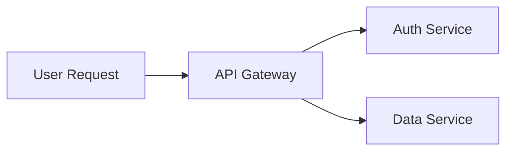
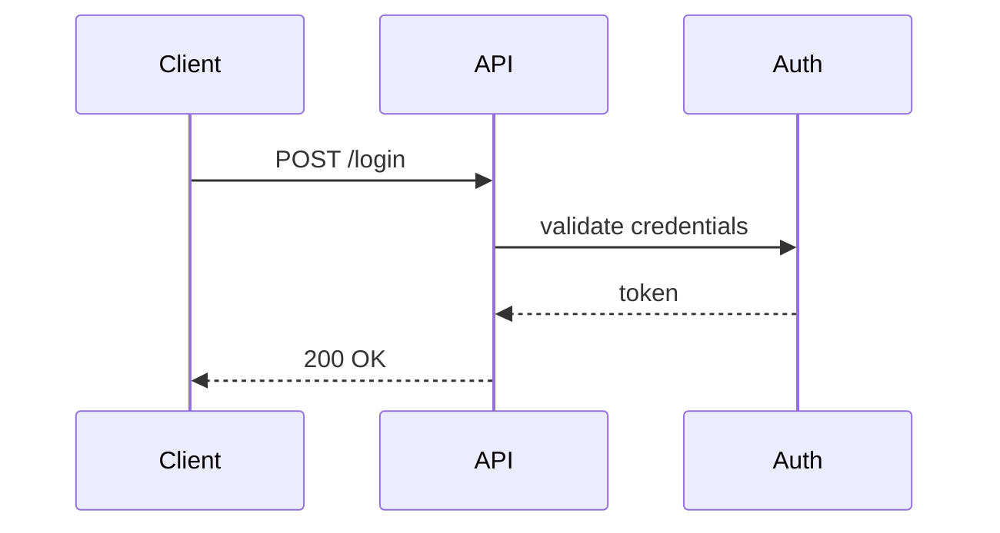

# Document-Focused Ingestion

## Summary

Narrow the file ingestion scope from 36 file types (mostly code/config) down to document-oriented types that provide design, specification, and requirements knowledge. Add support for spreadsheets (.xlsx, .xls), ArchiMate models (.archimate), and semantic extraction of mermaid diagrams embedded in markdown.

Coding agents already have direct file access tools for code discovery, so ingesting code files adds cost (CPU, storage, retrieval noise) without meaningful value.

## Scope

### File types to keep

| Extension | Extractor | Library |
|-----------|-----------|---------|
| `.md` | Plain text read + mermaid enrichment | stdlib |
| `.txt` | Plain text read | stdlib |
| `.pdf` | PDF page text extraction | `pypdf` (existing) |
| `.docx` | OOXML zip extraction | `zipfile` (existing) |

### File types to add

| Extension | Extractor | Library |
|-----------|-----------|---------|
| `.xlsx` | Sheet-by-sheet with headers | `openpyxl` (new) |
| `.xls` | Sheet-by-sheet with headers | `xlrd` (new) |
| `.archimate` | XML element + relationship parsing | `xml.etree` (stdlib) |

### File types to drop

All code and config types: `.py`, `.ts`, `.tsx`, `.js`, `.jsx`, `.java`, `.go`, `.rs`, `.c`, `.cc`, `.cpp`, `.cs`, `.h`, `.hpp`, `.css`, `.html`, `.json`, `.yaml`, `.yml`, `.toml`, `.sql`, `.sh`, `.xml`, `.gradle`, `.kt`, `.kts`, `.scala`, `.swift`, `.rb`, `.mjs`.

### New feature: mermaid semantic enrichment

When processing `.md` files, detect fenced code blocks tagged as `mermaid`. Parse node labels and edges into natural-language text appended to the containing section. This makes diagram content searchable.

## Detailed Design

### 1. FileExtractor changes (extractors.py)

Replace `plain_text_suffixes`:

```python
# Before: 34 code/config types
# After:
plain_text_suffixes = {".md", ".txt"}
supported_suffixes = plain_text_suffixes | {".pdf", ".docx", ".xlsx", ".xls", ".archimate"}
```

Add three new extraction methods called from `extract()` based on suffix:
- `_extract_xlsx(path) -> str`
- `_extract_xls(path) -> str`
- `_extract_archimate(path) -> str`

### 2. Spreadsheet extraction

Both `.xlsx` and `.xls` produce the same output format. Each sheet becomes a text section:

```
## Sheet: Revenue Forecast

Quarter | Revenue | Growth
Q1 2025 | 1200000 | 15%
Q2 2025 | 1380000 | 15%

## Sheet: Expenses

Category | Amount | Notes
Infra | 50000 | AWS costs
Staffing | 200000 | Engineering team
```

Rules:
- First non-empty row is treated as column headers
- Each subsequent row is pipe-delimited with header context
- Empty sheets are skipped
- Sheet name becomes a heading (feeds into heading-aware chunking in local.py)
- Cell values are coerced to strings; None/empty cells become empty string

`.xlsx` uses `openpyxl.load_workbook(path, read_only=True, data_only=True)`.
`.xls` uses `xlrd.open_workbook(path)`.

### 3. ArchiMate extraction

The Archi native `.archimate` format is XML. Key structures:

- `<element>` nodes with attributes: `xsi:type`, `name`, `id`, and optional `<documentation>` child
- `<relationship>` nodes with attributes: `xsi:type`, `source`, `target`, `name`

Extraction produces natural language grouped by ArchiMate layer:

```
## Business Layer

Business Process: "Order Fulfillment"
Handles the end-to-end order lifecycle from receipt to delivery.

Business Actor: "Customer"

## Application Layer

Application Component: "Payment Gateway"
Processes credit card transactions and returns authorization codes.

Application Service: "Payment API"

## Relationships

"Order Fulfillment" serves "Customer Portal" (ServingRelationship)
"Payment Gateway" is used by "Order Fulfillment" (ServingRelationship)
```

Layer grouping is derived from the `xsi:type` prefix (e.g., `archimate:BusinessProcess` -> Business Layer). Elements without documentation still appear with their name and type. Relationships reference element names (resolved via id lookup).

ArchiMate type-to-layer mapping:
- **Business**: BusinessActor, BusinessRole, BusinessCollaboration, BusinessInterface, BusinessProcess, BusinessFunction, BusinessInteraction, BusinessEvent, BusinessService, BusinessObject, Contract, Representation, Product
- **Application**: ApplicationComponent, ApplicationCollaboration, ApplicationInterface, ApplicationFunction, ApplicationInteraction, ApplicationProcess, ApplicationEvent, ApplicationService, DataObject
- **Technology**: Node, Device, SystemSoftware, TechnologyCollaboration, TechnologyInterface, Path, CommunicationNetwork, TechnologyFunction, TechnologyProcess, TechnologyInteraction, TechnologyEvent, TechnologyService, Artifact
- **Strategy**: Resource, Capability, CourseOfAction, ValueStream
- **Motivation**: Stakeholder, Driver, Assessment, Goal, Outcome, Principle, Requirement, Constraint, Meaning, Value
- **Implementation**: WorkPackage, Deliverable, ImplementationEvent, Plateau, Gap

Elements whose type doesn't match a known layer go under "Other".

### 4. Mermaid semantic enrichment

In `local.py`, `_parse_markdown_sections()` already processes markdown line by line. After section parsing, detect mermaid code blocks within each section's text and append a natural-language summary.

Supported diagram types:
- `graph` / `flowchart`: extract node labels and `-->` / `---` edges
- `sequenceDiagram`: extract `participant` declarations and `X->>Y: message` interactions

Parsing approach:
- Regex to find fenced blocks: `` ```mermaid ... ``` ``
- Line-by-line parsing within the block for node definitions and edges
- Output appended to the section text as `\n\nDiagram: ...`

Example input in markdown:

````

````

Appended text:

```
Diagram: User Request connects to API Gateway. API Gateway connects to Auth Service. API Gateway connects to Data Service.
```

For sequence diagrams:

````

````

Appended text:

```
Diagram: Client sends POST /login to API. API sends validate credentials to Auth. Auth replies token to API. API replies 200 OK to Client.
```

Unrecognized mermaid types are left as-is (the raw syntax is still ingested as part of the markdown text).

### 5. Dependencies

Add to `pyproject.toml` dependencies:

```
"openpyxl>=3.1,<4.0",
"xlrd>=2.0,<3.0",
```

No other new dependencies.

### 6. Files changed

| File | Change |
|------|--------|
| `libs/file-ingest/src/second_brain_file_ingest/extractors.py` | Shrink suffix sets, add xlsx/xls/archimate extraction methods |
| `libs/file-ingest/src/second_brain_file_ingest/local.py` | Add mermaid enrichment to markdown section parsing |
| `pyproject.toml` | Add openpyxl, xlrd dependencies |
| `tests/` | New tests for each extractor, discovery narrowing, mermaid enrichment |

### 7. What does NOT change

- `local.py` discovery logic — already filters by `supported_suffixes`
- Database schema — unchanged
- MCP server — unchanged
- Config/Settings — no new env vars
- Chunking logic — unchanged (heading-aware chunking works with new formats because we output headings)
- Embedding logic — unchanged

## Testing

- **Spreadsheet extraction**: small fixture `.xlsx` and `.xls` files with multiple sheets, empty sheets, mixed types
- **ArchiMate extraction**: minimal `.archimate` XML fixture with elements across layers and relationships
- **Mermaid enrichment**: markdown with graph, flowchart, and sequenceDiagram blocks
- **Discovery narrowing**: verify `.py`, `.ts`, etc. are no longer discovered; verify `.md`, `.pdf`, `.xlsx`, `.archimate` still are
- **Existing tests**: verify pdf/docx/md/txt extraction is unchanged
- **Edge cases**: empty spreadsheet, archimate file with no documentation fields, mermaid block with unrecognized type
